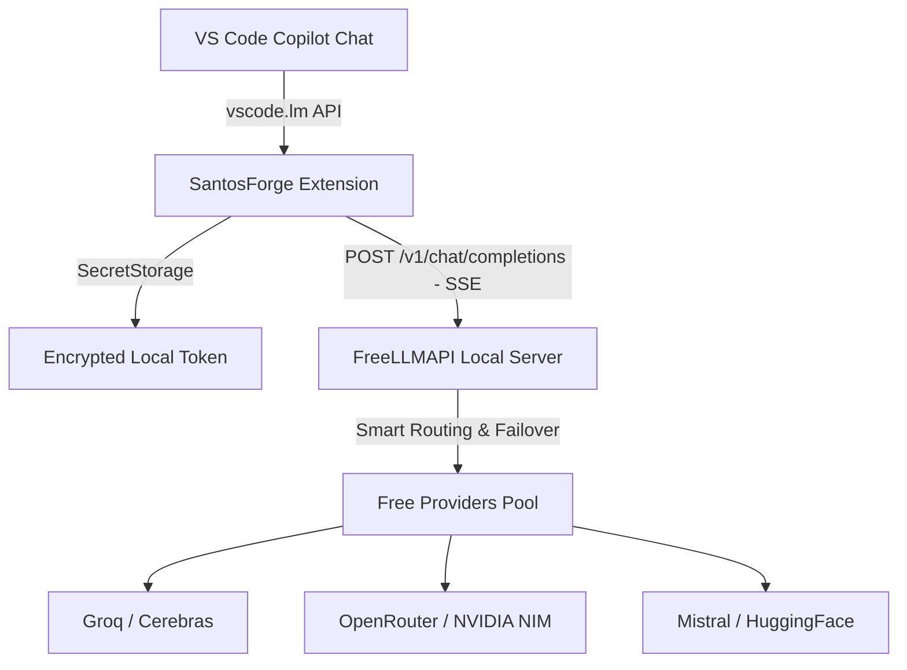

<p align="center">
  
</p>

<h1 align="center">SantosForge</h1>

<p align="center">
  <b>Integrate hundreds of free LLM models into GitHub Copilot Chat natively.</b>
</p>

<p align="center">
  
  
  
  
</p>

> [!WARNING]
> **Active Development:** This project is currently in active development. Features, model mappings, and configuration schemas may evolve rapidly.

---

## 🌟 Overview

**SantosForge** is a Visual Studio Code extension (`.vsix`) that bridges your local **FreeLLMAPI** instance directly into **GitHub Copilot Chat** (including Copilot's Agent mode). 

It registers itself as a native VS Code **Language Model Provider**, allowing you to pick free open-source models (such as **Llama 3.3 70B, DeepSeek R1, Qwen 2.5 Coder, Mistral, Nemotron**, etc.) directly from Copilot's model picker dropdown.

### ✨ Real-Time Status Bar Tracking

When sending prompts, SantosForge monitors the response stream and reveals the **actual upstream model** that answered (including automatic failover detection) and your **exact token usage**:

```text
✨ groq/llama-3.3-70b-versatile · 1.2k↑ 340↓ · Σ45k
```

* **Hover** on the status item to inspect prompt/completion tokens, duration, fallback attempts, and session totals.
* **Click** to open the per-model token breakdown and quick actions.

---

## 🏗️ Architecture



---

## 🚀 Quick Start

### 1. Run FreeLLMAPI
1. Download and run the **FreeLLMAPI Desktop app** or spin it up via Docker (see [FreeLLMAPI docs](https://github.com/tashfeenahmed/freellmapi)).
2. Open your local dashboard (Desktop default is `http://127.0.0.1:31415`, Docker default is `http://localhost:3001`).
3. In the **Keys** tab, add at least one free provider key (e.g., [Groq](https://console.groq.com/keys), [Cerebras](https://cloud.cerebras.ai), [OpenRouter](https://openrouter.ai/keys), or [NVIDIA NIM](https://build.nvidia.com/)).
4. Copy your master key from the **Keys** or **Agents** tab (format: `freellmapi-...`).

### 2. Install SantosForge
1. Download the latest `.vsix` package from the [Releases](https://github.com/PHenrique07/SantosForge/releases) page.
2. In VS Code, go to the Extensions panel (`Ctrl+Shift+X`), click `...` at the top right, and choose **Install from VSIX...**.
3. Select `santosforge-0.0.2.vsix`.
4. When prompted by the notification, paste your unified key (`freellmapi-...`).
   *(Or press `Ctrl+Shift+P` → **SantosForge: Set FreeLLMAPI Token**).*
5. If using the Desktop app, make sure your URL setting points to `http://127.0.0.1:31415/v1` in Settings (`Ctrl+,` → search `santosforge.apiUrl`).

### 3. Chat in Copilot
1. Open GitHub Copilot Chat (`Ctrl+Alt+I`).
2. Open the model selector dropdown above the chat input.
3. Select any **SantosForge** model:
   * **Auto (Recommended · Best Choice)**: routes automatically to the best available free model.
   * **Auto (Smartest)**: prioritizes deep-reasoning models (DeepSeek R1, Nemotron, Llama 70B).
   * **Auto (Fastest)**: routes to ultra-low latency providers (Cerebras, Groq).
   * **Direct Models**: pick specific models like `GPT-OSS 120B`, `Qwen 2.5 Coder`, etc.

---

## ⚙️ Configuration

| Setting | Default | Description |
|---|---|---|
| `santosforge.apiUrl` | `http://localhost:3001/v1` | Base URL of your FreeLLMAPI instance (`http://127.0.0.1:31415/v1` for Desktop). |
| `santosforge.onlyReadyModels` | `true` | Show only models that have active, healthy keys available right now. |
| `santosforge.maxModels` | `60` | Maximum number of models listed in the Copilot dropdown. |
| `santosforge.enableToolCalling` | `true` | Announces tool calling capabilities (required for Copilot Agent Mode). |
| `santosforge.showModelInResponse` | `false` | Appends a subtle footer to responses displaying the resolved model and tokens. |

---

## 💻 Commands

Access via `Ctrl+Shift+P`:

* **SantosForge: Set FreeLLMAPI Token** — Securely store your key in VS Code's encrypted SecretStorage.
* **SantosForge: Test Connection** — Ping your local server and verify model availability.
* **SantosForge: Refresh Model List** — Query FreeLLMAPI catalog and update Copilot's picker.
* **SantosForge: View Token Usage** — Inspect request counts and token consumption per model.
* **SantosForge: Reset Token Counter** — Reset local usage statistics.
* **SantosForge: Remove Stored Token** — Delete your cached key from SecretStorage.

---

## 🛠️ Development

```bash
# Clone the repository
git clone https://github.com/PHenrique07/SantosForge.git
cd SantosForge

# Install dependencies
npm install

# Compile TypeScript
npm run compile

# Package new VSIX
npm run package
```

Press **F5** in VS Code to launch an Extension Development Host window for live debugging.

---

## 🙏 Credits & Acknowledgments

This project is built on top of and specifically designed to interface with:

* **[FreeLLMAPI](https://github.com/tashfeenahmed/freellmapi)** by **Tashfeen Ahmed**: the open-source router aggregating free-tier AI inference across 34+ providers behind a unified OpenAI-compatible endpoint.

---

## 📄 License

**Proprietary License** — Copyright © 2026 Santos. All rights reserved.  
Unauthorized copying, modification, or redistribution of this software is strictly prohibited. See [LICENSE](LICENSE) for details.
