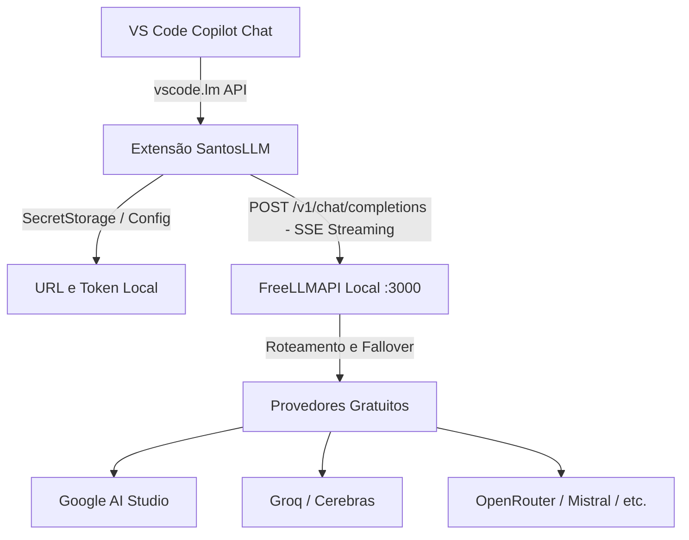

# SantosLLM - Plano de Projeto e Arquitetura

Extensão para Visual Studio Code (`.vsix`) que integra o **FreeLLMAPI** ao **GitHub Copilot Chat**, permitindo utilizar centenas de modelos gratuitos (Llama 3.3, Gemini 2.0, Qwen, DeepSeek, etc.) nativamente no seletor de modelos do Copilot.

---

## 1. Visão Geral e Arquitetura

O usuário roda sua própria instância do **FreeLLMAPI** localmente (ou em rede interna). A extensão **SantosLLM** registra-se no VS Code como um **Language Model Provider**, fazendo a ponte entre as mensagens do Copilot Chat e a API compatível com OpenAI do FreeLLMAPI.



---

## 2. Requisitos e Pré-requisitos

### Ambiente do Desenvolvedor
* **Node.js**: v18+ (recomendado v20 LTS).
* **VS Code**: Versão 1.90+ (com GitHub Copilot instalado).
* **Ferramental CLI**: `npm`, `yo` (Yeoman) e `@vscode/vsce` (para empacotar o `.vsix`).

### Ambiente do Usuário Final (Você e Amigos)
* Instância do **FreeLLMAPI** rodando (via Docker, executável desktop ou Node local).
* Pelo menos 1 chave de API configurada no FreeLLMAPI (ex: Google AI Studio ou Groq, ambas gratuitas).
* Token de autorização gerado no painel do FreeLLMAPI.

---

## 3. Estrutura Proposta do Projeto

```
santos-llm/
├── .vscode/
│   ├── launch.json              # Depuração no VS Code (F5 abre Extension Host)
│   └── tasks.json
├── src/
│   ├── extension.ts             # Ponto de entrada (ativação e comandos)
│   ├── config.ts                # Gestão de configurações e SecretStorage (token)
│   ├── provider.ts              # Implementação de vscode.lm.LanguageModelChatProvider
│   ├── types.ts                 # Tipagens da API OpenAI e do FreeLLMAPI
│   └── client.ts                # Cliente HTTP com fetch nativo e parser SSE
├── package.json                 # Manifesto declarando o provider e comandos
├── tsconfig.json
└── README.md                    # Instruções de setup e uso
```

---

## 4. Fases de Implementação

### Fase 1: Inicialização e Manifesto (`package.json`)
* Criar a pasta do projeto (fora do Sementis, ex: `d:\Programacao\SantosLLM`).
* Inicializar projeto TypeScript para VS Code Extension (`yo code` ou template manual limpo).
* Declarar a contribuição no `package.json`:
  * `contributes.languageModelChatProviders` com vendor `santosllm` e display name `SantosLLM`.
  * `contributes.configuration` com a URL base (`santosllm.apiUrl`, padrão `http://localhost:3000/v1`).
  * `contributes.commands`: `santosllm.setToken` (para inserir a chave com facilidade).

### Fase 2: Configuração e Armazenamento Seguro
* Criar comando para salvar o token do FreeLLMAPI via `vscode.window.showInputBox({ password: true })`.
* Persistir o token de forma criptografada usando `context.secrets.store('santosllm.token', key)` (não expor em settings.json plano).
* Carregar a URL base via `vscode.workspace.getConfiguration('santosllm').get('apiUrl')`.

### Fase 3: Provedor de Modelos (`SantosChatModelProvider`)
Implementar a interface oficial `vscode.lm.LanguageModelChatProvider`:
1. **`provideLanguageModelChatInformation`**:
   * Chamar `GET /v1/models` no FreeLLMAPI.
   * Mapear os modelos retornados (ou modelos padrão configuráveis) para o formato do VS Code com id, nome e tamanho de janela de contexto.
2. **`provideLanguageModelChatResponse`**:
   * Converter o histórico de mensagens do Copilot (`messages`) para o formato padrão OpenAI (`[{ role, content }]`).
   * Fazer requisição `POST /v1/chat/completions` com `stream: true`.
   * Tratar o stream Server-Sent Events (SSE) linha por linha e alimentar `responseStream.text(chunk)`.
   * Suportar cancelamento através de `cancellationToken.onCancellationRequested`.
3. **`provideTokenCount`**:
   * Estimar contagem de tokens (aproximação baseada em caracteres ou tiktoken leve).

### Fase 4: Testes Locais e Tratamento de Exceções
* Validar comportamento quando o FreeLLMAPI estiver offline (exibir notificação amigável com botão para verificar a URL).
* Validar quando o token for inválido (HTTP 401).
* Testar alternância entre modelos diretamente no dropdown do Copilot Chat.

### Fase 5: Empacotamento VSIX e Distribuição
* Instalar CLI oficial: `npm install -g @vscode/vsce`.
* Gerar o pacote: `vsce package` -> gera `santosllm-0.0.1.vsix`.
* Testar instalação manual no VS Code (`Extensions -> ... -> Install from VSIX...`).
* Elaborar um `README.md` simples explicando aos seus amigos como rodar o FreeLLMAPI e instalar o `.vsix`.

---

## 5. Próximos Passos Imediatos

1. Abrir/criar a pasta dedicada para o projeto (ex: `d:\Programacao\SantosLLM`).
2. Inicializar a estrutura de arquivos da extensão.
3. Testar a conexão com o FreeLLMAPI local.
